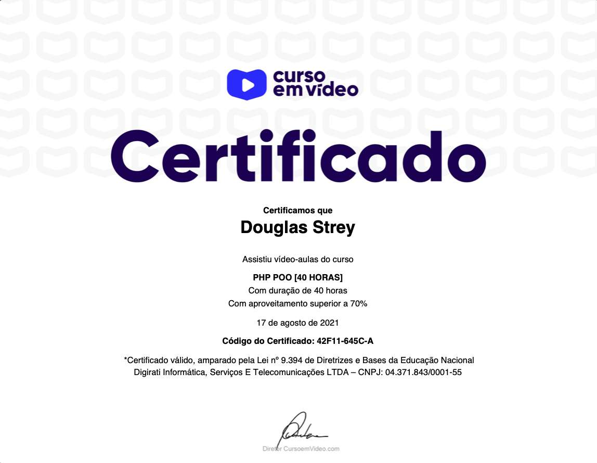

<!-- 

 

 -->

## 🚀 Tecnologias

Neste curso foram utilizadas as seguintes tecnologias:

- PHP;
- HTML;
- CSS;

## 💻 Curso

Curso que feito no site [Curso em Vídeo](https://www.cursoemvideo.com/course/php-poo/) para aprendizado de maneira mais avançada da linguagem PHP, com Programação Orientada a Objeto.
